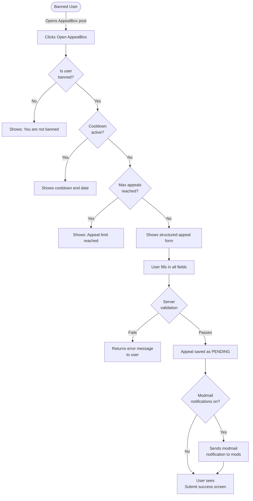
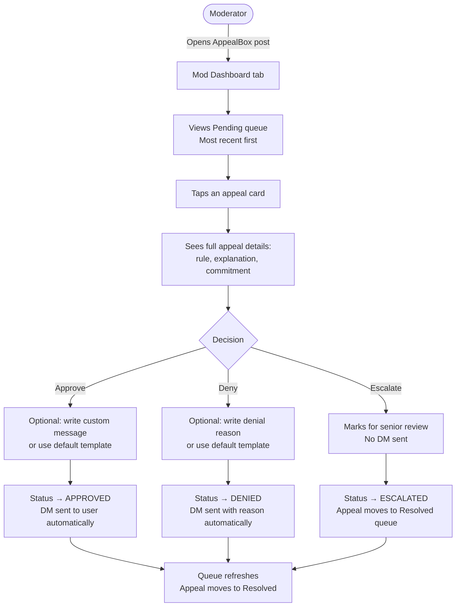
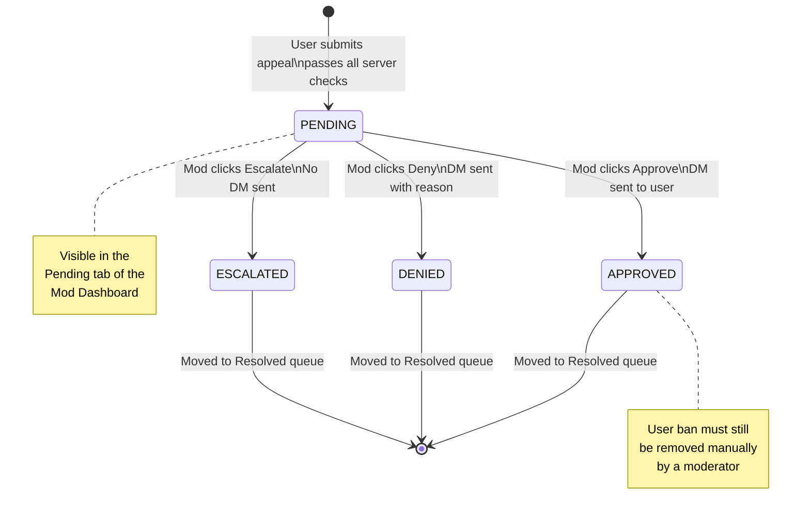
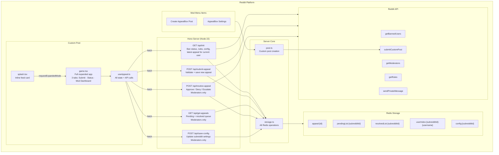
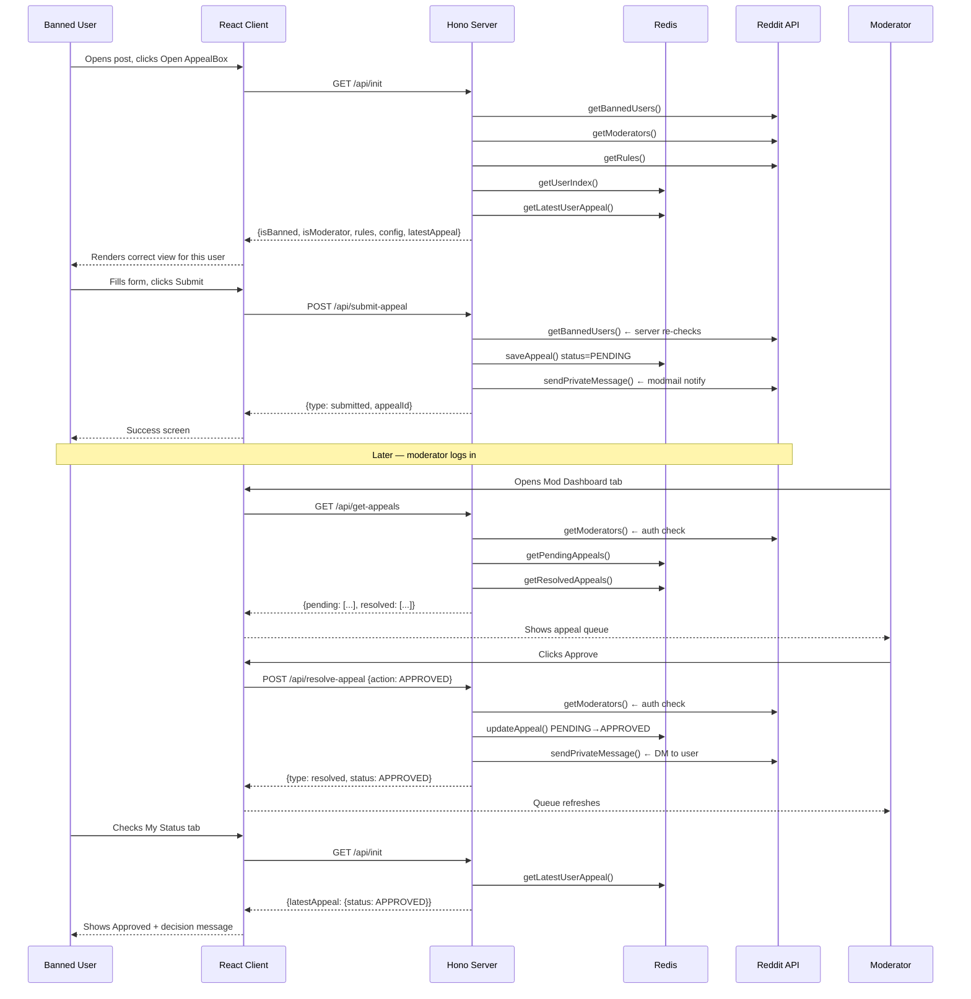
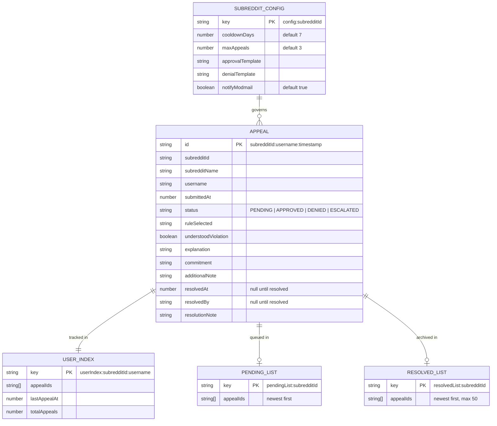
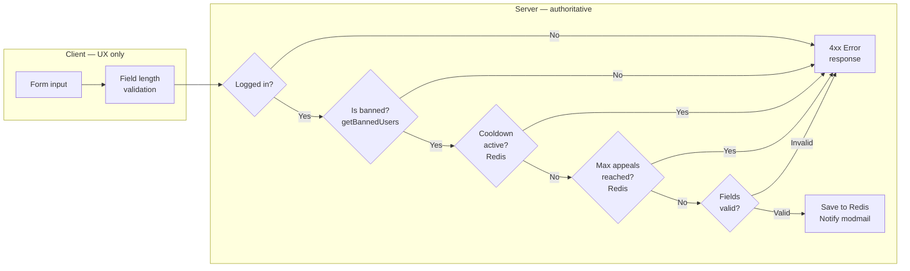

# AppealBox

**Structured ban appeals and a dedicated moderator queue for Reddit communities — built on Devvit.**

[](https://developers.reddit.com)
[](https://react.dev)
[](https://typescriptlang.org)
[](https://hono.dev)
[](./LICENSE)

[How It Works](#how-it-works) · [Quick Start](#quick-start) · [Architecture](#architecture) · [API Reference](#api-reference) · [Security Model](#security-model)

---

## Table of Contents

1. [The Problem](#the-problem)
2. [The Solution](#the-solution)
3. [Without AppealBox vs With AppealBox](#without-appealbox-vs-with-appealbox)
4. [Features](#features)
5. [How It Works](#how-it-works)
   - [Submitting an Appeal](#submitting-an-appeal)
   - [Moderator Review Flow](#moderator-review-flow)
6. [Architecture](#architecture)
7. [Project Structure](#project-structure)
8. [Quick Start](#quick-start)
9. [Testing](#testing)
10. [API Reference](#api-reference)
11. [Data Model](#data-model)
12. [Security Model](#security-model)
13. [Configuration](#configuration)
14. [Tech Stack](#tech-stack)

---

## The Problem

When Reddit bans a user, there is no official appeal process. The result is chaos on both sides.

**For moderators**, ban appeals arrive mixed in with reports, community questions, and spam — unstructured, inconsistent, and invisible to the rest of the team. On active subreddits this can consume **2–5 hours of moderator time per week**, with no audit trail and no way to track what was decided or by whom.

**For banned users**, there is no form, no confirmation, no status update. They send a modmail and hear nothing. The frustration leads to repeated messages, ban evasion, and an overall worse experience for everyone.

The core issue is structural: Reddit's modmail is a general-purpose inbox, and appeal management is a specialised workflow. Using one for the other creates noise for mods and opacity for users.

---

## The Solution

AppealBox installs on any subreddit in one click and replaces the chaotic modmail appeal process with a purpose-built, structured system directly inside Reddit.

```
Banned user opens the AppealBox post
         │
         ▼
Fills in a structured form: rule broken → explanation → commitment
         │
         ▼
Appeal saved with status PENDING — user sees confirmation instantly
         │
         ▼
Mod opens the dedicated dashboard (separate from modmail entirely)
         │
         ▼
One-click Approve / Deny / Escalate — DM sent to user automatically
         │
         ▼
User checks their status tab → sees the decision and the mod's message
```

Update policy without touching modmail. Per-community configuration with no extra setup. Every decision is recorded with who made it and when.

---

## Without AppealBox vs With AppealBox

| Scenario                   | Without AppealBox                      | With AppealBox                                       |
| -------------------------- | -------------------------------------- | ---------------------------------------------------- |
| User appeals a ban         | ✗ Free-text modmail, no structure      | ✓ Structured form with required fields               |
| Mod finds the appeal       | ✗ Buried in general modmail            | ✓ Dedicated queue, completely separate               |
| User knows the status      | ✗ No confirmation, no updates          | ✓ Real-time status tab (Pending / Approved / Denied) |
| Mod sends a decision       | ✗ Manual modmail reply                 | ✓ Automatic DM on Approve or Deny                    |
| User reappeals 10 times    | ✗ No limit, mod inbox flooded          | ✓ Configurable cooldown and lifetime limit           |
| Team sees all decisions    | ✗ No audit trail                       | ✓ Full history in the Resolved queue                 |
| Install on a new community | ✗ Process must be rebuilt from scratch | ✓ One-click install, zero-config defaults            |
| Change cooldown to 3 days  | ✗ No such setting exists               | ✓ Settings menu in the mod tools                     |

---

## Features

| Feature                          | Description                                                                                                                    |
| -------------------------------- | ------------------------------------------------------------------------------------------------------------------------------ |
| **Structured appeal form**       | Users select the rule they broke, acknowledge the violation, explain their side, and commit to better behaviour — all required |
| **Dedicated mod queue**          | Appeals are separated from modmail entirely. Mods see only appeals in the dashboard, with full context                         |
| **One-click decisions**          | Approve, Deny, or Escalate any appeal with a single tap and an optional custom message                                         |
| **Automatic DMs**                | Users receive a Reddit direct message with the decision and the mod's response automatically                                   |
| **Status tracker**               | Banned users can check their appeal status at any time — Pending, Approved, Denied, or Escalated                               |
| **Cooldown enforcement**         | Configurable wait period before a user can reappeal (default: 7 days). Enforced server-side                                    |
| **Appeal limits**                | Configurable maximum lifetime appeals per user (default: 3). Enforced server-side                                              |
| **Custom templates**             | Approval and denial message templates fully configurable by the mod team                                                       |
| **Modmail notifications**        | Optional ping to modmail when a new appeal arrives                                                                             |
| **Moderator-only dashboard**     | The Mod Dashboard tab is hidden from regular users — only confirmed moderators see it                                          |
| **Server-side validation**       | All constraints (ban check, cooldown, limits, field lengths) enforced on the server — cannot be bypassed                       |
| **Auto-creates post on install** | The AppealBox post is created automatically when the app is installed. No manual setup required                                |

---

## How It Works

### Submitting an Appeal



### Moderator Review Flow



### Appeal State Machine

Every appeal transitions through exactly one path. No state can be reversed.



---

## Architecture

AppealBox is built on the Devvit React template (devvit 0.12.24). The architecture is a clean client-server split — the React frontend makes standard HTTP fetch calls to a Hono server that has access to Redis and the Reddit API.



### Request Sequence



---

## Project Structure

```
appeal-box/
├── src/
│   ├── client/                     # React frontend — runs inside Reddit iFrame
│   │   ├── hooks/
│   │   │   └── useAppeal.ts        # All API calls, state management, error handling
│   │   ├── game.html               # HTML entry point for expanded view
│   │   ├── game.tsx                # Full app: Submit · Status · Mod Dashboard tabs
│   │   ├── splash.html             # HTML entry point for inline feed view
│   │   ├── splash.tsx              # Compact "Open AppealBox" card shown in feed
│   │   ├── index.css               # Tailwind CSS import
│   │   ├── global.ts               # CSS module declaration
│   │   └── module.d.ts             # Asset type declarations
│   │
│   ├── server/                     # Hono backend — serverless Node 22
│   │   ├── core/
│   │   │   ├── post.ts             # submitCustomPost helper
│   │   │   └── storage.ts          # All Redis read/write operations
│   │   ├── routes/
│   │   │   ├── api.ts              # /api/* REST endpoints
│   │   │   ├── forms.ts            # /internal/form/settings-submit
│   │   │   ├── menu.ts             # /internal/menu/* mod actions
│   │   │   └── triggers.ts         # /internal/triggers/on-app-install
│   │   └── index.ts                # Hono app, route registration
│   │
│   └── shared/
│       ├── api.ts                  # Legacy template types (kept for compatibility)
│       └── types.ts                # All shared TypeScript types: Appeal, Config, API shapes
│
├── tools/                          # TypeScript project references
│   ├── tsconfig.base.json
│   ├── tsconfig.client.json
│   ├── tsconfig.server.json
│   ├── tsconfig.shared.json
│   └── tsconfig.vite.json
│
├── devvit.json                     # App manifest: post entrypoints, menus, forms, triggers
├── vite.config.ts                  # Vite + Rolldown build config
├── package.json
└── tsconfig.json                   # Root TypeScript project references
```

---

## Quick Start

### Prerequisites

| Tool           | Version  | Notes                           |
| -------------- | -------- | ------------------------------- |
| Node.js        | ≥ 22.2.0 | Required by Devvit              |
| npm            | ≥ 10     | Included with Node              |
| Devvit CLI     | 0.12.24  | `npm install -g devvit`         |
| Reddit account | Any      | Must be mod of a test subreddit |

### Installation

```bash
# Clone the repository
git clone https://github.com/your-username/appeal-box.git
cd appeal-box

# Install dependencies
npm install

# Log in to Reddit via Devvit
npm run login
```

### Development

```bash
# Start dev mode — builds and watches for changes
npm run dev
# Prompts for your test subreddit name, e.g. r/appealbox_test
```

Keep this terminal running. Vite rebuilds on every save and the changes appear live in your test subreddit.

### Build

```bash
# Type-check, lint, and upload to Reddit
npm run deploy
```

### Publish

```bash
# Deploy then submit for App Directory review
npm run launch
```

---

## Testing

### Setup

You need two things before testing:

1. **A private test subreddit** — Create one at [reddit.com/subreddits/create](https://www.reddit.com/subreddits/create). Set it to Private. Your account is automatically the moderator.
2. **A second Reddit account** — This will act as the banned user in your tests.

### Create the AppealBox Post

With `npm run dev` running and playtesting active on your test subreddit:

1. Go to your test subreddit as a moderator
2. Click the `···` overflow menu
3. Click **"Create AppealBox Post"**
4. You are redirected to the newly created post

### Test Checklist

#### Splash view

| Test                      | Expected result                                     |
| ------------------------- | --------------------------------------------------- |
| View the post in the feed | Compact AppealBox card with "Open AppealBox" button |
| Click "Open AppealBox"    | Expands to the full app                             |

#### Non-banned user (Submit tab)

| Test                              | Expected result              |
| --------------------------------- | ---------------------------- |
| Open as the **moderator** account | "You are not banned" message |

#### Banned user flow

| Test                                              | Expected result                           |
| ------------------------------------------------- | ----------------------------------------- |
| Ban your second account from the test subreddit   | —                                         |
| Log in as second account, open the post           | Structured form with rule dropdown        |
| Submit with all fields empty                      | Red error messages on required fields     |
| Write fewer than 50 characters in the explanation | "Write at least 50 characters" error      |
| Fill all fields correctly and submit              | "Appeal submitted" success message        |
| Check modmail as moderator                        | "[AppealBox] New ban appeal" notification |

#### Status tab

| Test                              | Expected result                                |
| --------------------------------- | ---------------------------------------------- |
| As banned user, click "My Status" | Shows `Under Review` with submission timestamp |
| Submitted content is visible      | Rule, explanation, and commitment displayed    |

#### Mod Dashboard

| Test                                 | Expected result                                         |
| ------------------------------------ | ------------------------------------------------------- |
| As moderator, click "Mod Dashboard"  | Tab is visible; banned user cannot see it               |
| View the Pending tab                 | Submitted appeal appears                                |
| Tap the appeal card                  | Full detail view with Approve / Deny / Escalate buttons |
| Click Approve with no custom message | Appeal moves to Resolved; default DM sent               |
| Check second account's Reddit DMs    | Approval message received                               |
| As second account, check "My Status" | Shows `Approved` status                                 |

#### Deny flow

| Test                                    | Expected result                            |
| --------------------------------------- | ------------------------------------------ |
| Submit another appeal as second account | —                                          |
| As mod, Deny with a custom message      | Status → Denied; custom message sent as DM |
| Check second account DMs                | DM contains the custom message             |

#### Cooldown

| Test                                     | Expected result                               |
| ---------------------------------------- | --------------------------------------------- |
| Try to submit a third appeal immediately | "Cooldown active. You can reappeal on [date]" |

#### Settings

| Test                                     | Expected result                   |
| ---------------------------------------- | --------------------------------- |
| As mod, click `···` → AppealBox Settings | Native settings form opens        |
| Change cooldown to 1 day, save           | Toast: "AppealBox settings saved" |

### Type Check and Lint

```bash
npm run type-check   # TypeScript project references check
npm run lint         # ESLint across src/**
```

---

## API Reference

All endpoints are served by the Hono server on the same origin as the custom post. The React client communicates via standard `fetch` calls.

### `GET /api/init`

Returns all data needed to render the correct view for the current user. Called once on mount.

**Auth:** Any logged-in Reddit user.

**Response:**

```typescript
type InitAppealResponse = {
  type: 'init';
  username: string;
  isBanned: boolean;
  isModerator: boolean;
  cooldownActive: boolean;
  cooldownEndsAt: number; // Unix ms
  maxAppealsReached: boolean;
  latestAppeal: Appeal | null;
  rules: string[]; // From subreddit rules via Reddit API
  config: SubredditConfig;
};
```

---

### `POST /api/submit-appeal`

Saves a new appeal. All constraints are enforced server-side regardless of client state.

**Auth:** Must be a banned user. Server re-checks ban status on every submission.

**Request body:**

```typescript
type SubmitAppealRequest = {
  ruleSelected: string;
  understoodViolation: boolean;
  explanation: string; // min 50 chars
  commitment: string; // min 20 chars
  additionalNote: string; // optional, max 300 chars
};
```

**Response:**

```typescript
type SubmitAppealResponse = {
  type: 'submitted';
  appealId: string;
};
```

---

### `GET /api/get-appeals`

Returns the pending and resolved appeal queues for the subreddit.

**Auth:** Moderators only. Server checks via `reddit.getModerators()`.

**Response:**

```typescript
type GetAppealsResponse = {
  type: 'appeals';
  pending: Appeal[];
  resolved: Appeal[]; // capped at 50 most recent
};
```

---

### `POST /api/resolve-appeal`

Approves, denies, or escalates an appeal. Sends a DM to the user on Approve and Deny.

**Auth:** Moderators only.

**Request body:**

```typescript
type ResolveAppealRequest = {
  appealId: string;
  action: 'APPROVED' | 'DENIED' | 'ESCALATED';
  note: string; // Empty string uses the default template from config
};
```

**Response:**

```typescript
type ResolveAppealResponse = {
  type: 'resolved';
  appealId: string;
  status: AppealStatus;
};
```

---

### `POST /api/save-config`

Updates the subreddit's AppealBox configuration.

**Auth:** Moderators only.

**Request body:**

```typescript
type SaveConfigRequest = Partial<SubredditConfig>;
// {cooldownDays, maxAppeals, approvalTemplate, denialTemplate, notifyModmail}
```

---

### Error Responses

All routes return typed errors on failure:

```typescript
type ErrorResponse = {
  status: 'error';
  message: string;
};
```

| HTTP Status | When                                                                   |
| ----------- | ---------------------------------------------------------------------- |
| `401`       | User not logged in                                                     |
| `400`       | Missing fields, cooldown active, max appeals reached, already resolved |
| `403`       | Non-banned user attempts submission; non-mod accesses mod endpoints    |
| `404`       | Appeal ID not found                                                    |
| `500`       | Unexpected server error                                                |

---

## Data Model

All data lives in Devvit's built-in Redis. No external database. Every key is scoped by `subredditId` so data from one community can never be accessed by another.



### Redis Keys

| Key pattern                          | Type        | Contents                                                  |
| ------------------------------------ | ----------- | --------------------------------------------------------- |
| `appeal:{id}`                        | JSON string | Full Appeal object                                        |
| `pendingList:{subredditId}`          | JSON string | Array of appeal IDs, newest first                         |
| `resolvedList:{subredditId}`         | JSON string | Array of resolved appeal IDs, newest first                |
| `userIndex:{subredditId}:{username}` | JSON string | UserIndex: appeal IDs, last appeal timestamp, total count |
| `config:{subredditId}`               | JSON string | SubredditConfig merged with defaults                      |

---

## Security Model

AppealBox enforces all constraints on the server. The client performs validation for UX only — it has no authoritative role.



| Layer                            | Protection                                                                                                                    |
| -------------------------------- | ----------------------------------------------------------------------------------------------------------------------------- |
| **Ban check on submission**      | `reddit.getBannedUsers()` called server-side on every `POST /api/submit-appeal` — cannot be bypassed by client-side state     |
| **Moderator check on dashboard** | `reddit.getModerators()` called server-side before any appeal data is returned or any resolve action is accepted              |
| **Cooldown enforcement**         | Stored as a Unix timestamp in Redis — client has no way to modify or skip it                                                  |
| **Appeal limit enforcement**     | `UserIndex.totalAppeals` incremented in Redis on every save — client counter is ignored                                       |
| **Cross-subreddit isolation**    | Every Redis key is prefixed with `subredditId` — no appeal or config from one community is ever accessible in another         |
| **Input validation**             | Field lengths and required fields are checked on the server after all auth checks pass — client validation is purely cosmetic |
| **Non-critical failures**        | Modmail notification and user DM are wrapped in try/catch so a Reddit API hiccup never causes the main flow to fail           |

---

## Configuration

Mods configure AppealBox from the subreddit mod menu: `···` → **AppealBox Settings**

| Setting            | Type    | Default   | Description                                              |
| ------------------ | ------- | --------- | -------------------------------------------------------- |
| `cooldownDays`     | number  | `7`       | Days a user must wait before submitting another appeal   |
| `maxAppeals`       | number  | `3`       | Maximum lifetime appeals allowed per user                |
| `approvalTemplate` | string  | See below | DM sent to the user when their appeal is approved        |
| `denialTemplate`   | string  | See below | DM sent to the user when their appeal is denied          |
| `notifyModmail`    | boolean | `true`    | Whether to send a modmail ping when a new appeal arrives |

**Default approval message:**

> Your appeal has been approved. A moderator will update your ban status shortly. Please review the community rules before participating again.

**Default denial message:**

> After careful review, your appeal has been denied. Please wait before reappealing.

Both templates can be edited freely. Mods can also write a custom per-appeal message at the time of decision, which overrides the template for that specific appeal.

---

## Tech Stack

**Frontend:** React 19 · Tailwind CSS 4 · TypeScript 6 · Vite 8

**Backend:** Hono 4 · Node.js 22 · Devvit Redis

**Platform:** Devvit 0.12.24 · @devvit/web · @devvit/start

**Build:** Vite 8 · Rolldown 1.0 · @vitejs/plugin-react · @tailwindcss/vite

**Tooling:** ESLint 10 · typescript-eslint 8 · Prettier 3

---

_Built for the [Reddit Mod Tools and Migrated Apps Hackathon 2026](https://devpost.com) · BSD-3-Clause License_

---

## User Interface Reference

### Inline Feed View (splash.tsx)

The AppealBox card appears in the subreddit feed as a compact custom post. It is intentionally minimal — its only job is to get the user into the app.

```
┌─────────────────────────────────────────────────────┐
│  ┌───┐                                               │
│  │ A │  AppealBox                                    │
│  └───┘  Structured ban appeals for r/gaming          │
│                                                      │
│           [ Open AppealBox ]                         │
└─────────────────────────────────────────────────────┘
```

Clicking "Open AppealBox" calls `requestExpandedMode` with the `game` entrypoint, expanding to the full application.

---

### Submit Tab — Banned User

The appeal form shows only when the server confirms the user is banned, not in cooldown, and has not reached their appeal limit.

```
┌──────────────────────────────────────────────────────────┐
│  📬 AppealBox                           u/banneduser    │
│  Structured ban appeals for this community               │
├──────────────────────────────────────────────────────────┤
│  [ Submit Appeal ]  [ My Status ]  [ Mod Dashboard* ]    │
├──────────────────────────────────────────────────────────┤
│                                                          │
│  ℹ Be specific, respectful, and honest. Moderators       │
│    can see every appeal in one dedicated queue.          │
│                                                          │
│  Which rule did you violate?                             │
│  ┌──────────────────────────────────────────────────┐    │
│  │ ▾  3. No spam or self-promotion                  │    │
│  └──────────────────────────────────────────────────┘    │
│                                                          │
│  Do you understand why this was a violation?             │
│  ┌─────────────────────────┐  ┌──────────────────────┐   │
│  │ ● Yes, I understand     │  │ ○ No, I need clarif  │   │
│  └─────────────────────────┘  └──────────────────────┘   │
│                                                          │
│  Explain your side (0 / 1000)                            │
│  ┌──────────────────────────────────────────────────┐    │
│  │                                                  │    │
│  │                                                  │    │
│  └──────────────────────────────────────────────────┘    │
│                                                          │
│  What will you do differently? (0 / 500)                 │
│  ┌──────────────────────────────────────────────────┐    │
│  │                                                  │    │
│  └──────────────────────────────────────────────────┘    │
│                                                          │
│  Anything else? Optional (0 / 300)                       │
│  ┌──────────────────────────────────────────────────┐    │
│  │                                                  │    │
│  └──────────────────────────────────────────────────┘    │
│                                                          │
│               [ Submit Appeal ]                          │
└──────────────────────────────────────────────────────────┘
* Mod Dashboard tab only visible to confirmed moderators
```

### Submit Tab — Restricted States

When the user cannot submit, the form is replaced with a clear explanation:

```
Not banned               Cooldown active            Limit reached
────────────             ───────────────            ─────────────
  You are                 Cooldown active           Appeal limit
  not banned                                         reached
                        You can submit a
This form is only       new appeal on             You have reached
for users who are       1 Jun 2026.               the maximum number
currently banned.                                 of appeals for this
                                                  community.
```

---

### My Status Tab

Shows the current state of the user's most recent appeal. The status badge, colour, and message update to reflect the moderator's decision.

```
PENDING                    APPROVED                   DENIED
────────                   ────────                   ──────
Submitted 24 May 2026      Submitted 24 May 2026      Submitted 24 May 2026
14:32                      14:32                      14:32

  Under review               Approved                   Denied

Your appeal is in          Your appeal was            [Custom denial message
the queue. You will        approved! A moderator      from the mod, or the
receive a Reddit DM        will update your ban       default denial template]
when a decision            status shortly.
is made.

──────────────────         ──────────────────         ──────────────────
YOUR SUBMISSION            YOUR SUBMISSION            YOUR SUBMISSION
RULE SELECTED              RULE SELECTED              RULE SELECTED
3. No spam                 3. No spam                 3. No spam
YOUR EXPLANATION           YOUR EXPLANATION           YOUR EXPLANATION
I didn't realise...        I didn't realise...        I didn't realise...
YOUR COMMITMENT            YOUR COMMITMENT            YOUR COMMITMENT
I will read the...         I will read the...         I will read the...
```

---

### Mod Dashboard — Queue View

The Mod Dashboard tab is only rendered for confirmed moderators. It shows a two-tab queue.

```
┌──────────────────────────────────────────────────────────┐
│  📬 AppealBox                           u/modname         │
├──────────────────────────────────────────────────────────┤
│  [ Submit Appeal ]  [ My Status ]  [ Mod Dashboard ]     │
├──────────────────────────────────────────────────────────┤
│  [ Pending (3) ]  [ Resolved (14) ]                      │
├──────────────────────────────────────────────────────────┤
│                                                          │
│  ┌──────────────────────────────────────────────────┐  │
│  │ u/banneduser1                       🟡 Pending   │  │
│  │ 24 May 2026, 14:32                                │  │
│  │ 3. No spam or self-promotion                      │  │
│  │ I didn't realise my post counted as spam since... │  │
│  │                               Tap to review →    │  │
│  └──────────────────────────────────────────────────┘  │
│                                                          │
│  ┌──────────────────────────────────────────────────┐  │
│  │ u/banneduser2                       🟡 Pending   │  │
│  │ 24 May 2026, 09:11                                │  │
│  │ 1. Be respectful                                  │  │
│  │ I was having a difficult day and responded in...  │  │
│  │                               Tap to review →    │  │
│  └──────────────────────────────────────────────────┘  │
│                                                          │
│  ┌──────────────────────────────────────────────────┐  │
│  │ u/banneduser3                       🟡 Pending   │  │
│  │ 23 May 2026, 22:47                                │  │
│  │ 5. No low-effort content                          │  │
│  │ My post was taken out of context, I was trying... │  │
│  │                               Tap to review →    │  │
│  └──────────────────────────────────────────────────┘  │
└──────────────────────────────────────────────────────────┘
```

---

### Mod Dashboard — Detail View

Tapping an appeal card opens the full detail view with the complete submission and decision controls.

```
┌──────────────────────────────────────────────────────────┐
│  ← Back to queue                                         │
├──────────────────────────────────────────────────────────┤
│  Appeal from                                             │
│  u/banneduser1                                           │
│  24 May 2026, 14:32                                      │
├──────────────────────────────────────────────────────────┤
│  RULE SELECTED                                           │
│  3. No spam or self-promotion                            │
│                                                          │
│  UNDERSTOOD VIOLATION                                    │
│  Yes                                                     │
│                                                          │
│  EXPLANATION                                             │
│  I didn't realise my post counted as spam since          │
│  I was just sharing a link I found genuinely useful.     │
│  I see now that rule 3 covers promotional content        │
│  regardless of intent.                                   │
│                                                          │
│  COMMITMENT                                              │
│  I will read the rules carefully before posting and      │
│  use the weekly thread for link sharing instead.         │
├──────────────────────────────────────────────────────────┤
│  Response to user                                        │
│  Leave blank to use the default message template         │
│  ┌──────────────────────────────────────────────────┐  │
│  │                                                  │  │
│  └──────────────────────────────────────────────────┘  │
│                                                          │
│  [ ✓ Approve ]   [ ✗ Deny ]   [ ↑ Escalate ]          │
└──────────────────────────────────────────────────────────┘
```

---

### AppealBox Settings (Mod Menu)

Accessible from `···` → **AppealBox Settings** in the subreddit mod menu. Uses Reddit's native form UI.

```
⚙️ AppealBox Settings
──────────────────────────────────────────────
Cooldown days *
┌──────────────────────┐
│  7                   │
└──────────────────────┘

Maximum appeals per user *
┌──────────────────────┐
│  3                   │
└──────────────────────┘

Approval message template *
┌──────────────────────────────────────────┐
│ Your appeal has been approved. A         │
│ moderator will update your ban status    │
│ shortly. Please review the community     │
│ rules before participating again.        │
└──────────────────────────────────────────┘

Denial message template *
┌──────────────────────────────────────────┐
│ After careful review, your appeal has    │
│ been denied. Please wait before          │
│ reappealing.                             │
└──────────────────────────────────────────┘

Notify modmail for new appeals  [✓]

                    [ Save settings ]
```

---

## Devvit Primitives Used

This section documents how each Devvit concept maps to a specific feature in AppealBox. Useful for developers building on this codebase or using it as a reference.

| Devvit Primitive                  | Where Used                              | Purpose                                                                 |
| --------------------------------- | --------------------------------------- | ----------------------------------------------------------------------- |
| `submitCustomPost`                | `src/server/core/post.ts`               | Creates the AppealBox post in the subreddit                             |
| Custom post — inline entrypoint   | `src/client/splash.html` + `splash.tsx` | The compact card shown in the feed                                      |
| Custom post — expanded entrypoint | `src/client/game.html` + `game.tsx`     | The full three-tab application                                          |
| `requestExpandedMode`             | `src/client/splash.tsx`                 | Expands from inline card to full app                                    |
| `context.subredditId`             | `src/server/routes/api.ts`              | Scopes every Redis key per community                                    |
| `context.subredditName`           | `src/server/routes/api.ts`              | Passed to Reddit API calls                                              |
| `context.username`                | `src/server/routes/api.ts`              | Identifies the current user server-side                                 |
| `redis.get` / `redis.set`         | `src/server/core/storage.ts`            | All persistent state: appeals, indexes, config                          |
| `reddit.getBannedUsers`           | `src/server/routes/api.ts`              | Verifies the user is banned before allowing submission                  |
| `reddit.getModerators`            | `src/server/routes/api.ts`              | Verifies moderator identity before dashboard access                     |
| `reddit.getRules`                 | `src/server/routes/api.ts`              | Populates the rule dropdown from subreddit rules                        |
| `reddit.sendPrivateMessage`       | `src/server/routes/api.ts`              | Sends decision DMs and modmail notifications                            |
| Hono menu route                   | `src/server/routes/menu.ts`             | Handles "Create AppealBox Post" and "AppealBox Settings" mod menu items |
| Hono form route                   | `src/server/routes/forms.ts`            | Handles settings form submission via `UiResponse.showForm`              |
| `onAppInstall` trigger            | `src/server/routes/triggers.ts`         | Auto-creates the AppealBox post when the app is first installed         |
| `UiResponse.navigateTo`           | `src/server/routes/menu.ts`             | Redirects mod to the new post after creation                            |
| `UiResponse.showForm`             | `src/server/routes/menu.ts`             | Opens the native Reddit settings form                                   |
| `UiResponse.showToast`            | `src/server/routes/forms.ts`            | Confirms settings saved to the mod                                      |

---

## Known Limitations

These are intentional constraints for v1, documented here for transparency.

| Limitation                                                                | Reason                                                                  | Notes                                                                                   |
| ------------------------------------------------------------------------- | ----------------------------------------------------------------------- | --------------------------------------------------------------------------------------- |
| Approving an appeal does not automatically unban the user                 | Reddit's API does not expose ban management via Devvit at this time     | Mod must unban manually after approving                                                 |
| Only the most recent appeal is shown in the Status tab                    | Keeps the UI focused and simple for v1                                  | Full history is stored in Redis and can be surfaced in a future version                 |
| Escalation is terminal — there is no secondary escalation queue in the UI | Scope constraint for v1                                                 | Escalated appeals appear in the Resolved tab where senior mods can find them            |
| Resolved list is capped at 50 entries                                     | Prevents unbounded Redis key growth                                     | This threshold can be raised by changing the `limit` argument in `getResolvedAppeals()` |
| Settings form uses Reddit's native modal                                  | Devvit constraint — no custom UI in mod menu flows                      | The native form is functional and well-suited to the task                               |
| No push notification when a decision is made                              | Reddit does not support proactive in-app notifications from Devvit apps | The Reddit DM is the best available notification channel                                |

---

## Comparison


|                               | No Process | Modmail | Google Form | Ban Appeal Subreddit | AppealBox |
| ----------------------------- | ---------- | ------- | ----------- | -------------------- | --------- |
| Structured fields             | ❌         | ❌      | ✅          | ❌                   | ✅        |
| Native Reddit experience      | ❌         | ✅      | ❌          | ✅                   | ✅        |
| Separate from general modmail | ❌         | ❌      | ✅          | ✅                   | ✅        |
| Status visible to user        | ❌         | ❌      | ❌          | ❌                   | ✅        |
| One-click mod decisions       | ❌         | ❌      | ❌          | ❌                   | ✅        |
| Automatic DM on decision      | ❌         | ❌      | ❌          | ❌                   | ✅        |
| Cooldown enforcement          | ❌         | ❌      | ❌          | ❌                   | ✅        |
| Appeal history per user       | ❌         | ❌      | ❌          | ❌                   | ✅        |
| Configurable by mod team      | ❌         | ❌      | ⚠️          | ⚠️                   | ✅        |
| One-click subreddit install   | ❌         | N/A     | ❌          | ❌                   | ✅        |

---

## Contributing

1. Fork the repository
2. Create a feature branch: `git checkout -b feat/my-feature`
3. Make your changes
4. Run `npm run type-check && npm run lint` — both must pass
5. Commit with a descriptive message
6. Open a pull request with a clear description of what changed and why

---

## License

BSD 3-Clause License — see [LICENSE](./LICENSE) for the full text.

Built by [tejashmkumar](https://reddit.com/user/tejashmkumar) for the [Reddit Mod Tools and Migrated Apps Hackathon 2026](https://devpost.com).

---

_AppealBox — because every banned user deserves a fair process, and every mod team deserves less chaos._
